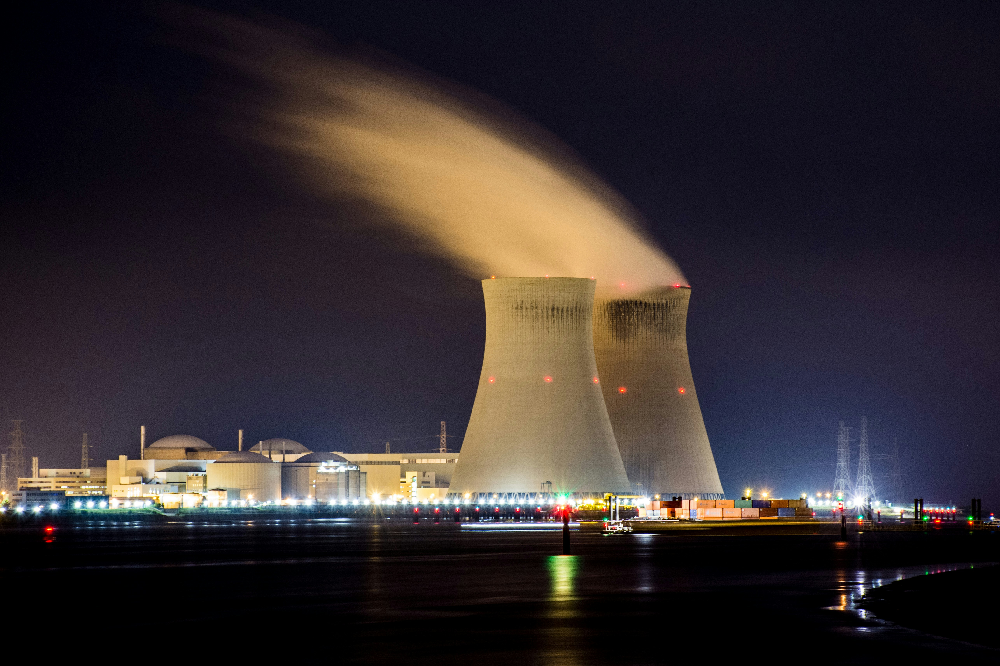
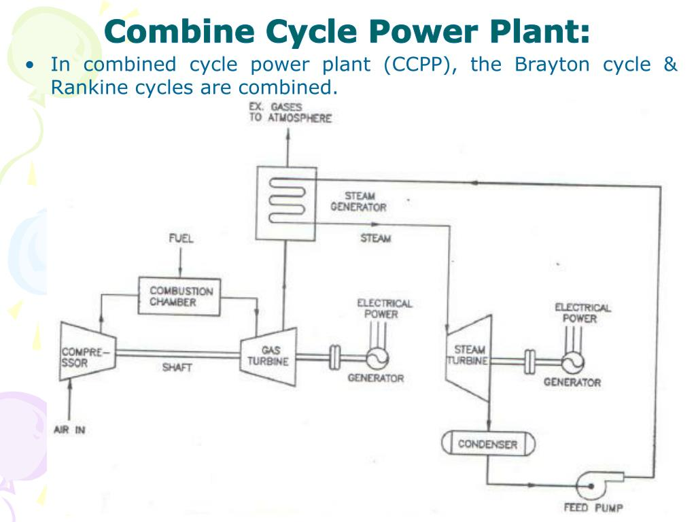
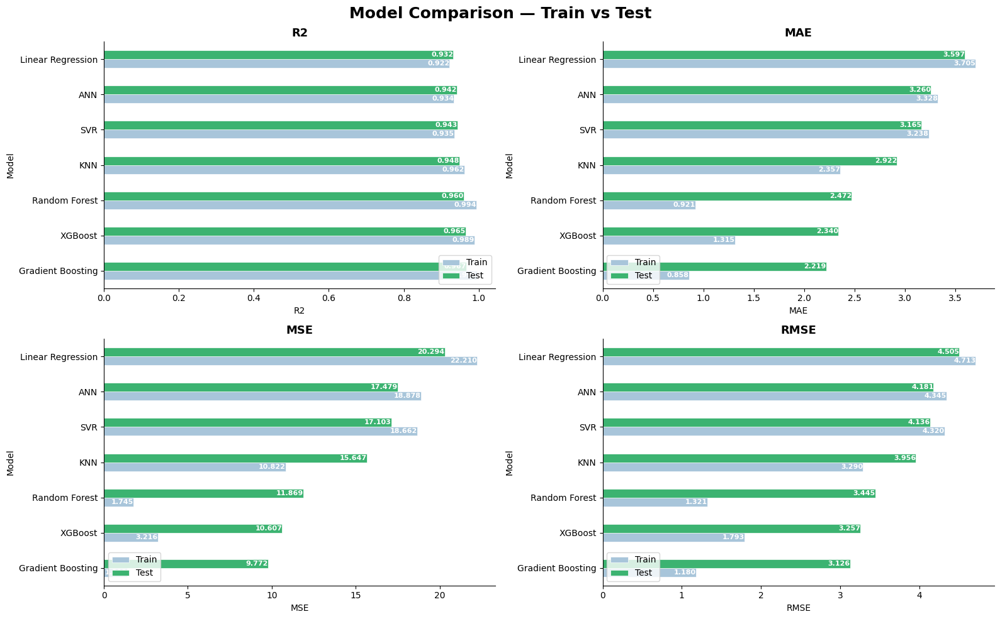
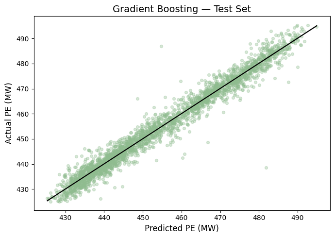
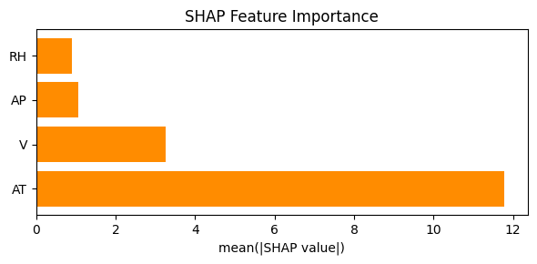
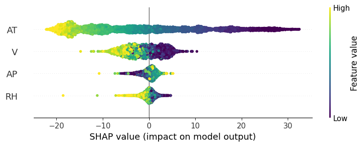

# Combined Cycle Power Plant — Energy Output Prediction



> Predicting the net hourly electrical energy output (PE) of a Combined Cycle Power Plant using machine learning — from raw sensor data to production-ready regression models.

---

## Project Overview

A **Combined Cycle Power Plant (CCPP)** generates electricity by running two turbine cycles in sequence — a gas turbine and a steam turbine — extracting maximum energy from a single fuel source. The output power varies with ambient conditions, making accurate prediction critical for grid planning and fuel optimisation.

This project covers the full ML pipeline: exploratory data analysis, missing value handling, feature engineering, statistical modelling, and training of 7 regression models with full interpretability analysis.

**How it works**



**Task:** Regression  
**Target:** `PE` — Net hourly electrical energy output (MW)  
**Dataset:** [UCI Machine Learning Repository — CCPP](https://archive.ics.uci.edu/dataset/294/combined+cycle+power+plant)

---

## Dataset

| Property | Value |
|----------|-------|
| Source | UCI Machine Learning Repository |
| Instances | 9,568 |
| Features | 4 (all continuous) |
| Collection period | 2006–2011 |
| Task | Regression |

| Feature | Description | Unit | Range |
|---------|-------------|------|-------|
| **AT** | Ambient temperature at compressor inlet | °C | 1.81 – 37.11 |
| **V** | Exhaust vacuum at steam turbine condenser | cm Hg | 25.36 – 81.56 |
| **AP** | Atmospheric pressure at plant site | mbar | 992.89 – 1033.30 |
| **RH** | Relative humidity of ambient air | % | 25.56 – 100.16 |
| **PE** | Net electrical energy output *(target)* | MW | 420.26 – 495.76 |

---

## Methodology

### 1. Exploratory Data Analysis
- Pairplot, Pearson & Spearman correlation heatmaps
- Distribution analysis for each feature (histogram, boxplot, KDE)
- Nonlinearity check via LOWESS regression

### 2. Missing Value Analysis
- MAR vs MCAR detection using independent t-tests
- Comparison of 5 imputation strategies: Mean, Median, Random Sample, KNN, Iterative (MICE)
- Best method selected by variance preservation

### 3. Feature Engineering
- Air density proxy: `ρ = AP×100 / (287.05 × (AT+273.15))`
- Interaction terms: `AP×AT`, `RH×AT`
- Outlier removal using IQR bounds (AP and RH)

### 4. Statistical Modelling (OLS)
- Coefficient significance, residual diagnostics
- VIF multicollinearity check
- Cook's Distance for leverage analysis

### 5. Machine Learning Models
All models trained on the same preprocessing pipeline:
`IterativeImputer / KNNImputer / RandomSampleImputer → RobustScaler → Model`

| # | Model |
|---|-------|
| 1 | Linear Regression |
| 2 | Random Forest |
| 3 | Gradient Boosting |
| 4 | SVR |
| 5 | KNN |
| 6 | XGBoost |
| 7 | ANN (Dense 64→32→1) |

### 6. Interpretability
- Built-in feature importances (impurity-based)
- Permutation importance
- SHAP values (summary plot + bar plot)

---

## Results

### Model Comparison



| Model | Test R² | Test MAE | Test RMSE |
|-------|---------|----------|-----------|
| **Gradient Boosting** | **0.965** | **2.219** | **3.126** |
| XGBoost | 0.965 | 2.340 | 3.257 |
| Random Forest | 0.960 | 2.472 | 3.445 |
| KNN | 0.948 | 2.922 | 3.956 |
| SVR | 0.943 | 3.165 | 4.136 |
| ANN | 0.942 | 3.260 | 4.181 |
| Linear Regression | 0.932 | 3.597 | 4.505 |

### Gradient Boosting — Predictions vs Actual



### SHAP Feature Importance





---

## Key Findings

1. **AT is the dominant predictor** — SHAP values range from −25 to +32 MW. High AT strongly pushes PE down; low AT pushes it up. Gradient Boosting achieves Test R² = **0.965**.

2. **V is the second most important feature** — SHAP values concentrated around ±5–10 MW. Higher vacuum consistently increases output.

3. **AP and RH have weak but meaningful effects** — narrow SHAP distributions close to zero; influence more visible at extreme values.

4. **Gradient Boosting is the best model** — Test R² 0.965, MAE 2.219, RMSE 3.126. Small Train/Test gap confirms good generalisation.

5. **Random Forest overfits** — Train R² 0.994 vs Test 0.960; largest Train/Test gap among all models.

6. **AT > V > AP > RH** — consistent feature ranking across SHAP, permutation importance, and OLS coefficients.

---

## Real-World Application

- **Grid planning** — forecast available capacity hours in advance using weather data (AT, AP, RH)
- **Fuel optimisation** — adjust fuel consumption precisely based on expected output
- **Maintenance detection** — if real PE drops below predicted PE at the same conditions, it signals equipment degradation (compressor fouling, condenser inefficiency)
- **Economic dispatch** — decide in real time whether to ramp up this plant or buy power from another source
- **Digital twin** — run "what-if" simulations (e.g. *what happens if temperature rises 5°C?*) without touching the physical plant

> The ~3.1 MW RMSE achieved by Gradient Boosting is less than **0.7% error** relative to the output range (420–496 MW) — accurate enough for real operational use.

---

## Tech Stack


```
pandas · numpy · matplotlib · seaborn · scipy
scikit-learn · xgboost · tensorflow/keras
feature-engine · shap · statsmodels
```

---

## Project Structure

```
├── CCPP_Complete.ipynb
├── images/
│   ├── PIC.jpg
│   ├── Scheme.jpg
│   ├── Model_Comparison.png
│   ├── Gradient.png
│   ├── SHAP_FI.png
│   └── SHAP.png
├── Folds5x2_pp_TP.xlsx)
└── README.md
```
